# FedLive: A Federated Transmission Framework for Panoramic Livecast with Reinforced Variational Inference

## 1. Abstract
Providing premium panoramic livecast services for worldwide viewers against the negative effects of its ultra-high data rate and delay-sensitive demands is still a significant challenge to the current delivery system. Therefore, it is imperative to explore an efficient way of improving the quality of experience while conserving the bandwidth resources for panoramic livecast. This paper expends the design space of both the Field of View (FoV) prediction and the multi-viewers 360◦ live streaming by presenting a novel cost-efficient federated transmission framework called FedLive. We first propose a gradient-based clustering method to group the geo-distributed viewers with similar viewing behavior into content delivery alliances by exploiting geometric properties of the gradient loss. With viewers’ resources integration, a Reinforced Variational Inference (RVI) structure-based approach is proposed to assist in the collaborative training of the FoV prediction model while accelerating multiple multi-rate tiles delivery. We further design a prediction-based asynchronous delivery algorithm, in which both the high accuracy FoV prediction and efficient live 360◦ video transmission are achieved in a decentralized manner. Finally, we use the synchronized algorithm as a benchmark to evaluate our solution performance over a real-world dataset. Additionally, prototype-based experimental results reveal that our approach provides the highest prediction accuracy, reduces delay, and saves bandwidth compared with state-of-the-art solutions.

## 2. Framework
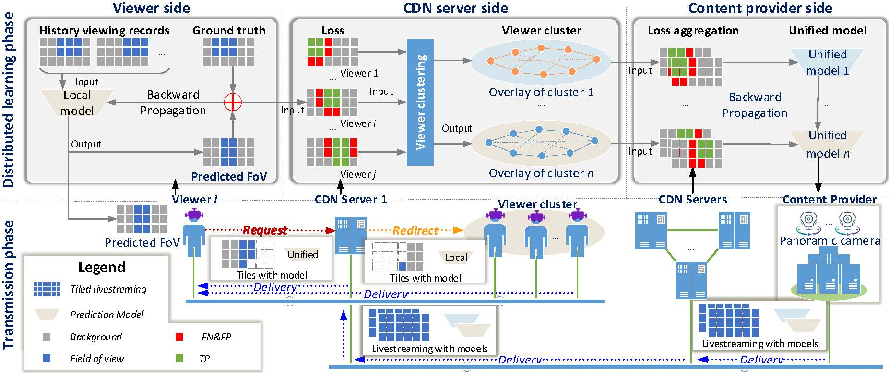

The above figure presents the diagram of FedLive, the proposed federated transmission framework for PLS. In FedLive multiple types of nodes are involved, including content providers, CDN servers, and viewers with HMDs.
FedLive contains two major phases including **distributed learning phase** and **transmission phase** with three blocks (_viewers side_, _CDN servers side_, and _content provider side_).
This repository introduces **distributed learning phase**.

 **In the distributed learning phase**, each viewer trains a local FoV prediction model with inputs of its local viewing records and prefetching records provided by the FoV prediction model.
The loss information as the output will be used for the local backward propagation and will also be captured by the nearby CDN servers as the input of the user clustering algorithm.
Especially, the loss matrix is calculated by adding the predicted FoV binary matrix to the ground truth binary matrix.
Once the CDN servers have collected the loss information from all viewers, they will invoke the gradient-based user clustering algorithm to divide the viewers into multiple viewer clusters.
Meanwhile, the CDN servers continuously summarize the loss value for each cluster and update it to the content provider along with the clustering results as the input for the unified model training.
With the loss information provided by the CDN servers, the content provider updates the unified model for each cluster with the weighted average loss value.
The process extends the concept of federated learning by adding clustering.
Further, the unified models will be distributed to viewers as part of the live streaming,
while the prefetching priority of different tiles is determined corresponding to the predicted results of the unified models.


## 3. Installation  

#### 3.1 Install dependent packages

We build FedLive with Torch+Gym. You can install as follow:  

- Torch: 1.10.1+cu113
- Python: 3.8
- Gym: 0.19.0
- OpenCV: 4.5.4.60
- Other python packages: please refer to <requestments.txt>

#### 3.2 Download FedLive

First of all, you should download FedLive from Github:  

```bash
git clone https://gitee.com/uglyghost123/FedLive.git
```

## 4. How To Use

#### 4.1 Folders  
- <b>./game/</b>: Files for RL agent and gym environment. It includes:
    - game/agent.py: RL agent
    - game/grid_video_world.py: the custom environment for 360-degree video FoV prediction
- <b>./log/</b>: Files for the experimental log.
- <b>./nn_model/</b>: Files for different RL policies.
    - nn_model/CNN.py: A simple convolutional neural network for sailency detection.
    - nn_model/AC.py: [Actor-Critic](https://proceedings.neurips.cc/paper/1999/file/6449f44a102fde848669bdd9eb6b76fa-Paper.pdf)
    - nn_model/DDPG.py: [Deep Deterministic Policy Gradient](https://spinningup.openai.com/en/latest/algorithms/ddpg.html)
    - nn_model/DDQN.py: [Double Deep Q-learning](https://ojs.aaai.org/index.php/AAAI/article/view/10295)
    - nn_model/DQN.py: [Deep Q-Learning](https://deepmind.com/research/open-source/dqn)
    - nn_model/PPO.py: [Proximal Policy Optimization](https://openai.com/blog/openai-baselines-ppo/)
    - nn_model/RVI.py: [Reinforced Variational Inference](http://thphn.com/papers/VIRL.pdf)
    - nn_model/SAC.py: [Soft Actor-Critic](https://arxiv.org/pdf/1801.01290.pdf)
    - nn_model/TD3.py: [Twin Delayed DDPG](https://dl.acm.org/doi/abs/10.1145/3387168.3387199)
- <b>./pic/</b>: Some pictures of the experiment results.
- <b>./save_model/</b>: Save RL models for different user clusters
- <b>./utils/</b>: Some data processing scripts.
- <b>./main.py</b>: Main function.
- <b>./arguments.py</b>: For arguments configuration. such --policy SAC, use soft AC policy
- <b>./get_frame.py</b>: Get the video frames.

#### 4.2 Prepare the datasets
- <b>./Saliency</b>: 360-degree saliency dataset. [link](https://zenodo.org/record/2641282#.Yd6jCPlByUl)  
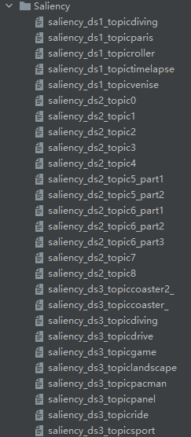  
- <b>./Videos</b>: Panoramic videos. [link](https://drive.google.com/file/d/1XEP7yp9ibrmfm4OxBU-l_XOEoeBG52Fb/view)  
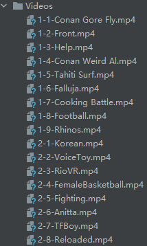  
- <b>./frames</b>: Frames extracted from the panoramic videos. (_Note configure the path first!_)  
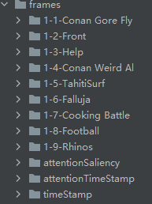  
```bash
python get_frames.py
```  
- <b>./VRdataset</b>: A head tracking dataset composes of 48 users (24 males and 24 females) watching 18 spherical videos from 5 categories. [link](https://wuchlei-thu.github.io/)  
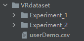  

#### 4.3 Run with SAC policy 
- Set parameters and file path before running the code.  
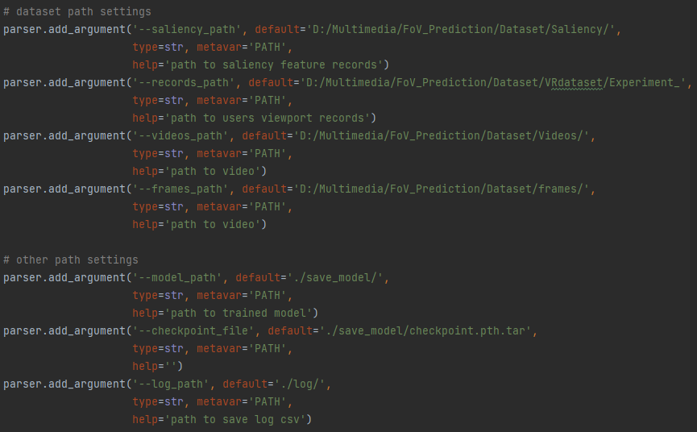  
- Start with SAC policy.
```bash
python main.py --policy SAC
```  
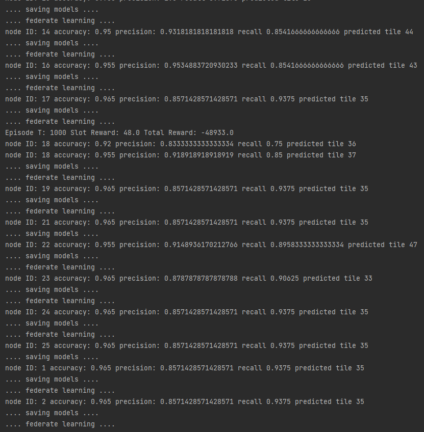


## 5. Selected Results

#### 5.1 Viewing experience   
with the custom environment "grid_video_world.py"  

  (RVI-SAC)  |  (RVI-AC)  |  (Ground truth)
:-------------------------:|:-------------------------:|:-------------------------:
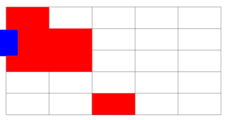 |   |  

  (RVI-A3C)  |  (RVI-DDPG)  |  (RVI-TD3)
:-------------------------:|:-------------------------:|:-------------------------:
 |   |  

  (RVI-DDQN)  |  (RVI-PPO)  |  (RVI-DQN)
:-------------------------:|:-------------------------:|:-------------------------:
 |   |  


#### 5.2 Accuracy, precision, and recall

Further, we evaluate the performance of our solution in terms of prediction accuracy, precision, and recall and we compare it with that of three state-of-the-art solutions: [LiveDeep](https://github.com/hwsel/LiveDeep), [LiveObj](https://github.com/hwsel/LiveObj), and [PanoSalNet](https://github.com/phananh1010/PanoSalNet), in an asynchronous manner.

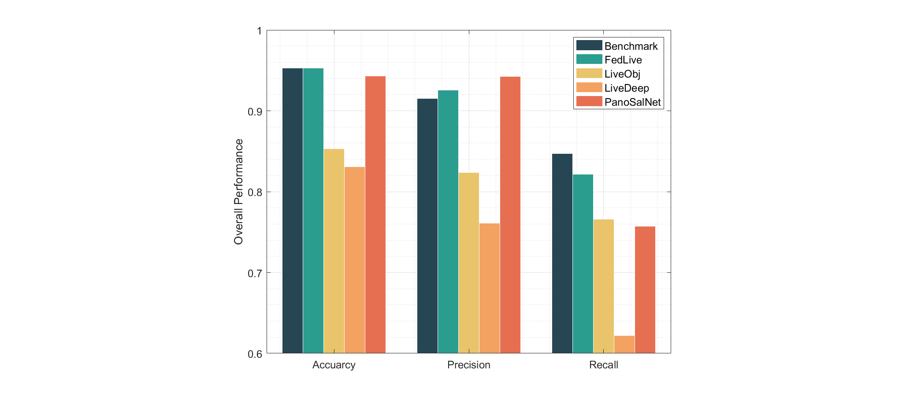
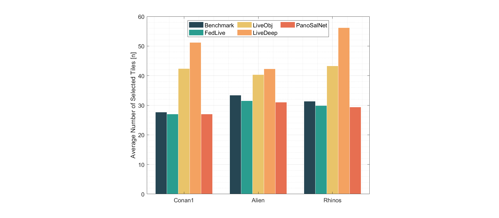
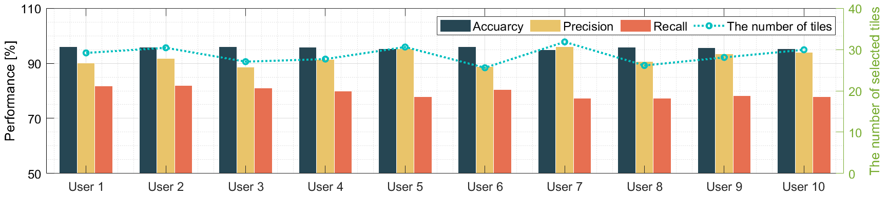

#### 5.3 The objective function (as QoE performance)

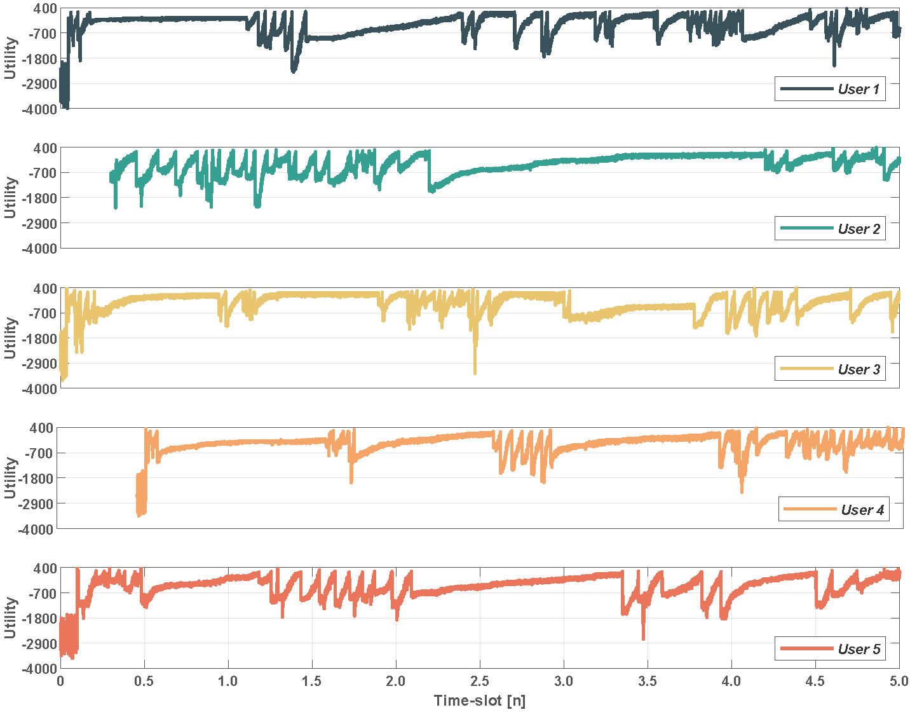
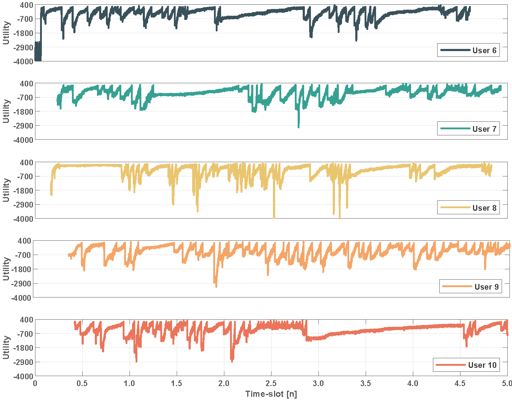

## 6. Contributors


## 7. Citation

## Contact
Xingyan Chen (xychen@swufe.edu.cn), Southwestern University of Finance and Economics
